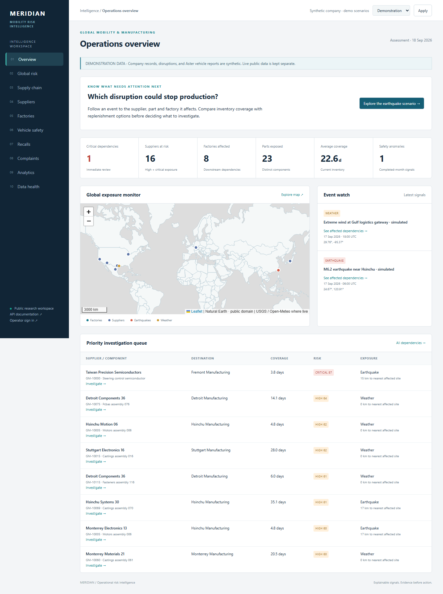
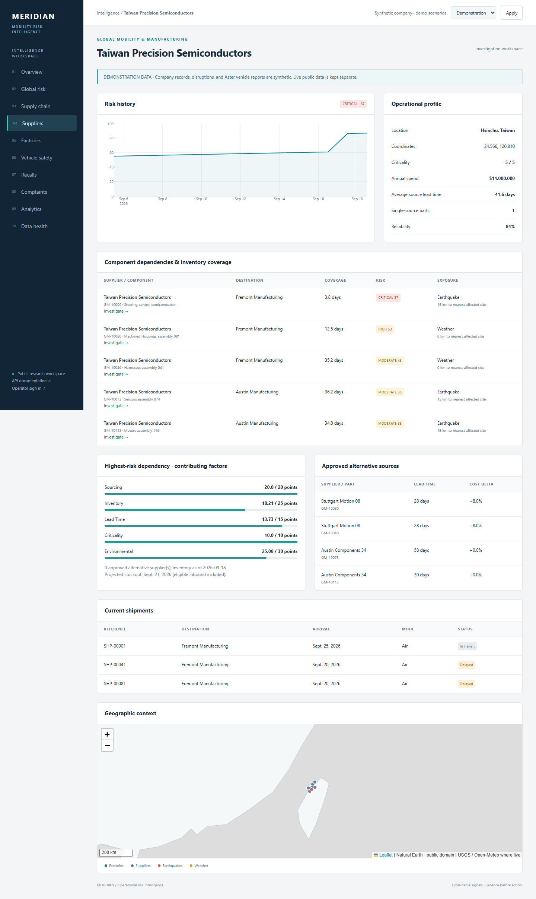
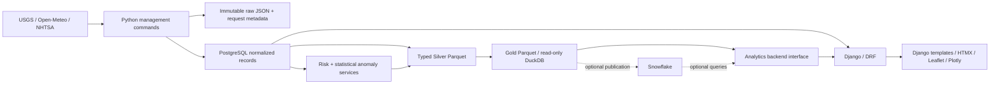
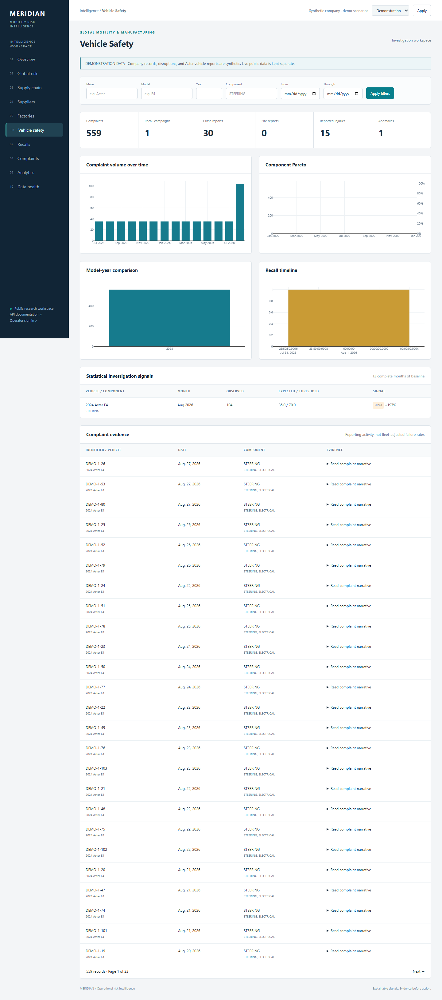

# Meridian — Global Mobility & Manufacturing Risk Intelligence

A Python/Django application for investigating how environmental disruptions expose suppliers, components and factories, alongside a separate automotive safety intelligence workspace.

The central question is operational: **which dependency needs attention, why, and how much inventory coverage remains?** Every risk score exposes its contributing factors. Public-source records retain provenance. Synthetic scenarios make the application useful immediately, without API keys or a warehouse account.



## Explore the product

**Start here:** open the dashboard and select **Explore the earthquake scenario**. In one guided investigation, follow the disruption to a semiconductor dependency, factory inventory and alternative sourcing checks. Pending qualification and unknown capacity stay explicit; recommendations never execute purchases or contact suppliers.

**Public hosting:** [Render + Neon setup](docs/hosting.md) includes a free-tier demo blueprint and restart recovery. No public deployment is claimed until provider setup and hosted checks are complete.

- **Operations overview:** priority dependencies, coverage, affected entities, map and event watch.
- **Global risk:** earthquakes, weather hazards and the dependencies exposed to them.
- **Supply chain:** supplier → part → factory paths, stock coverage and sourcing concentration.
- **Supplier / factory investigations:** score history, factor breakdowns, parts, shipments and approved alternatives.
- **Vehicle safety:** complaint timelines, component counts, model-year comparisons, recall history and statistical anomalies.
- **Analytics:** versioned Gold datasets queried through DuckDB or an optional Snowflake adapter.
- **Data health:** ingestion status, source freshness, watermark, loaded/skipped/rejected counts and quality exceptions.

Visitors can explore without signing in. Public APIs are read-only. Staff administration requires authentication.

## Run locally

Prerequisites: Docker Desktop/Engine with Compose.

```sh
git clone <your-repository-url>
cd <repository-directory>
cp .env.example .env
docker compose up --build -d
docker compose exec web python manage.py generate_company_data
docker compose exec web python manage.py publish_analytics --mode demo
```

Open **http://localhost:8000**. API documentation is at **/api/docs/**. On Windows, use `Copy-Item .env.example .env` instead of `cp` if needed.

The seed is deterministic (`--seed 42 --as-of 2026-09-18`). Re-running the same seed/reference date does not duplicate company records, complaint scenarios or risk history. Keep the fixed date for reproducible screenshots, or pass another ISO reference date deliberately.

For native Python/Django development, configure PostgreSQL in `.env`, then:

```powershell
./scripts/dev.ps1 setup
./scripts/dev.ps1 seed
./scripts/dev.ps1 run
```

Linux/macOS developers can activate a Python 3.13 virtual environment and use `make setup`, `make seed`, `make run`. Node is used only to compile and bundle frontend assets. **Django templates render the frontend; there is no React or Next.js application.**

See [deployment and operations](docs/deployment.md) for PostgreSQL setup, scheduling, production settings, backup and recovery.

## Immediate demonstration

1. Open the critical Taiwan Precision Semiconductors dependency.
2. Inspect `GM-10000`, its 3.8 days of inventory, 45-day lead time and lack of an approved alternative.
3. Follow the component to Fremont Manufacturing.
4. Inspect the separate simulated high-wind disruption at the Gulf logistics hub and its routed shipments.
5. Open Vehicle safety: Aster E4 steering complaints increase from 35/month to 104, exceeding the documented rolling threshold.

All these records are labeled synthetic. The dataset selector separates them from live USGS/NHTSA/Open-Meteo data. Real complaints are never presented as evidence against synthetic suppliers.



## Architecture and stack



Python 3.13, Django 5.2 LTS, Django REST Framework, PostgreSQL 17, DuckDB, Arrow/Parquet, HTTPX, Tailwind CSS, HTMX, Leaflet, Plotly, pytest, Ruff, Playwright, Docker Compose and GitHub Actions. Dependency resolutions are committed in `requirements.lock` and `package-lock.json`.

The app is organized into core, supply-chain, environmental, automotive, risk, ingestion and analytics domains. Database access, pure scoring rules, source adapters and presentation are separated. There is no required cloud warehouse, Redis, Celery or paid AI API.

## Real data pipeline

| Layer | Purpose |
|---|---|
| RAW | Preserve original request responses, request parameters, retrieval time and content hashes |
| SILVER | Normalize identifiers, dates, types, geography and public-source records; export typed facts |
| GOLD | Publish supplier/factory risk summaries, inventory exposure, event exposure, automotive trends and anomalies |

Ingestion uses source IDs and payload hashes, bounded retries, rate pacing and PostgreSQL advisory locks. Rejections are recorded individually. Failed/partial runs do not advance their source watermark. Analytical publication writes a complete version before changing the reader pointer, retaining the previous good dataset on failure.

```sh
python manage.py ingest_usgs
python manage.py ingest_nhtsa --dataset all
# Weather requires live facility/site/hub records configured by an operator:
python manage.py ingest_weather
python manage.py calculate_risk --mode live
python manage.py publish_analytics --mode live
```

Public ingestion is incremental/reconciled. Analytical snapshots are currently rebuilt as a bounded batch. Source terms, endpoint details and limitations are in [data sources](docs/data-sources.md); table grains are in [data model](docs/data-model.md).

## Risk and anomaly methodology

Dependency risk is `30E + 25I + 20S + 15L + 10C`, where the normalized factors represent environmental exposure, inventory pressure, single-source exposure, replenishment pressure and supplier criticality. Thresholds are 25 / 50 / 75 for MODERATE / HIGH / CRITICAL. Results retain factor values and point contributions.

Earthquake impact combines magnitude and Haversine distance. Weather rules use explicit temperature, precipitation and wind thresholds. Scores prioritize investigation; they are not calibrated damage probabilities.

Automotive detection compares the latest completed month against 12 prior complete months, with minimum counts, a variance floor and explicit thresholds. Narrative rules preserve matched keywords and category evidence. Complaint counts are reporting activity, not vehicle-normalized failure rates. Read the exact formulas and assumptions in [risk methodology](docs/risk-model.md).



## API

Read endpoints include:

```text
GET /api/v1/suppliers/
GET /api/v1/suppliers/{id}/
GET /api/v1/factories/
GET /api/v1/risk/events/
GET /api/v1/automotive/complaints/
GET /api/v1/automotive/recalls/
GET /api/v1/automotive/anomalies/
GET /api/v1/dashboard/
GET /api/v1/map/?bbox=-180,-90,180,90
```

Use `?mode=demo` (default) or `?mode=live`. List APIs default to 50 records, capped at 200. Filter/order options appear in the OpenAPI schema at `/api/schema/`. Example: `/api/v1/automotive/complaints/?mode=live&vehicle__make=TESLA&filed_on__gte=2025-01-01&ordering=-filed_on`.

## Testing and checks

With a local PostgreSQL development role that can create a test database:

```sh
python -m pytest -q
python -m ruff check .
python -m ruff format --check .
python manage.py check
python manage.py makemigrations --check --dry-run
npm run build
python -m playwright install chromium
# With the seeded application running:
python scripts/browser_check.py
```

Tests cover score thresholds and monotonicity, distance edge cases, inventory arrival timing, parser validation, repeat ingestion, source revisions, failures/watermarks, dataset separation, read-only APIs, model constraints, page rendering, query counts, empty analytical contracts and failed-publication recovery. Browser checks cover ten routes, supplier investigation, chart/map rendering and responsive layout. Screenshots are generated from the actual Django application.

CI uses PostgreSQL, builds assets, checks migrations, runs pytest and executes the browser journey. No live API or Snowflake account is required for deterministic CI.

## Optional Snowflake

Set `ANALYTICS_BACKEND=duckdb` for permanent local operation. The optional warehouse has a dedicated adapter and explicit publication command. SQL artifacts demonstrate RAW VARIANT preservation, SILVER JSON normalization, Gold contracts, suspended Dynamic Tables, a separate audit stream/task, RBAC and resource monitoring. See [Snowflake setup and verification status](snowflake/README.md).

Snowflake execution requires an account and has not been verified here. No automatic task activation or cloud provisioning occurs during local setup.

## Engineering decisions and limits

- PostgreSQL is the sole operational database; no SQLite substitution.
- The company model supports multiple sites and sources per part. Inventory and sourcing concentration explain risk rather than random scores.
- The map has an attributed offline Natural Earth background, avoiding dependence on paid map tiles.
- No authentication barrier is imposed on recruiters; writes remain staff-only.
- The current publication pipeline favors reproducible snapshots over distributed processing. Partition-level analytical refresh and retention automation are future improvements.
- The weather integration evaluates current conditions, not historical reconstruction or transport routing predictions.
- USGS reconciliation covers a rolling 30-day window; deleted/older revised events require broader reconciliation work.
- NHTSA coverage is limited to the checked-in watchlist. Statistical signals have reporting-bias and fleet-denominator limitations.
- Each shipment supports one optional hub. Capacity-constrained alternative allocation and multi-leg routing are future extensions.
- Docker Engine is running and Compose configuration validates, but image downloads failed with registry EOF errors, so container execution remains unverified. PostgreSQL-native verification is recorded in [verification](docs/verification.md).
- Public hosting, DNS/TLS setup and actual warehouse parity testing require external accounts. The application has not been published to a public URL.

Additional documentation: [architecture](docs/architecture.md), [data model](docs/data-model.md), [risk model](docs/risk-model.md), [sources](docs/data-sources.md), [operations](docs/deployment.md).
