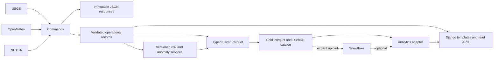

# Architecture

Meridian is a Python/Django monolith. Django templates own the frontend; HTMX replaces filtered table fragments. Leaflet and Plotly are bounded JavaScript enhancements. All assets and a Natural Earth background are served locally.

## Ownership and boundaries

- PostgreSQL owns company data, normalized public records, historical risk assessments, watermarks, ingestion runs and publication pointers.
- The ingestion package owns HTTP behavior, source normalization, evidence preservation and rejection accounting. Commands orchestrate services; web requests never ingest data.
- Pure risk and automotive functions have no database or network dependencies. Their orchestration services persist auditable results.
- The operational UI uses ORM selectors for current investigation data. The Analytics screen reads published datasets through the backend protocol. Changing warehouse does not change operational APIs or risk calculations.
- Parquet is the durable analytical interchange. DuckDB catalogs are versioned local read models, not the primary application database.

## Consistency

Source-specific PostgreSQL advisory locks prevent overlapping ingestion in the same dataset. Each accepted record commits independently. An interrupted run can therefore be replayed safely: already accepted source IDs are recognized, and the watermark remains unchanged. Rejected rows produce a partial run and prevent watermark advancement.

Raw responses are immutable request-level envelopes with request parameters, retrieval timestamps, hashes and source IDs inside their payloads. Identical pages within a run share content-addressed storage. Metadata retains each retrieval. No credentials appear in source requests.

Analytical publication reads a repeatable PostgreSQL snapshot. It writes all Silver/Gold files and closes the catalog before inserting the `Publication` row. That row is the commit point. Failed builds leave unreferenced directories; readers retain the previous publication. Garbage collection is deliberately an operator action after checking publication references.

Readers open catalogs read-only; publication creates a new file instead of modifying an active catalog. This avoids DuckDB's cross-process write contention. Deployment requires persistent storage for `DATA_ROOT` and PostgreSQL.

## Dataset modes

`demo` and `live` use separate natural-key namespaces, query filters and publication pointers. Demo company data and Aster vehicle reports are synthetic. The generator never creates real NHTSA reports. Live weather requires actual configured live locations; the application will not silently treat a synthetic facility as a live company asset.

## Deployment shape

One web process group and one PostgreSQL service are sufficient. Ingestion and publication are scheduled commands. No Redis, Celery, Node frontend server, or paid API is required. Docker uses a Node build stage only to compile and bundle frontend assets; production requests are served by Django/Gunicorn.

Public pages and GET APIs are read-only. Django administration is staff-authenticated and CSRF-protected. Production settings require a secret and default to HTTPS, secure cookies and `DEBUG=False`. TLS termination and host/origin allowlists are deployment responsibilities.

## Tradeoffs

The portfolio dataset is intentionally bounded. Publication currently rebuilds analytical snapshots; **external source ingestion is incremental/idempotent**, while Gold refresh is a batch snapshot. This makes rollback and offline reproduction simple. A production-scale deployment should partition/rebuild only changed analytical ranges and implement retention policies.

Spatial evaluation is a Haversine scan over configured sites and recent events. A spatial index/PostGIS becomes appropriate at significantly larger scale. Current graph presentation focuses on the investigated dependency path rather than rendering an unreadable whole-company network.
