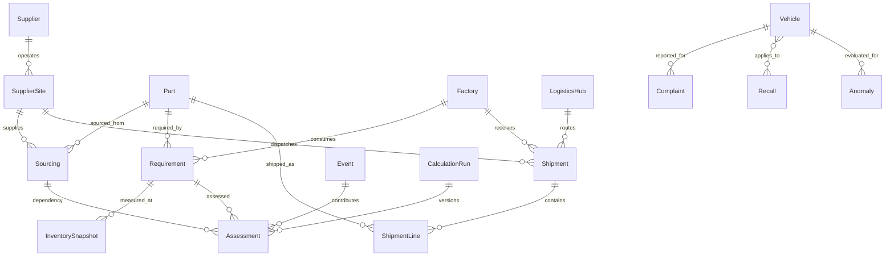

# Data model and analytical grains

Company identities use `(mode, code/part number)`. A supplier can operate multiple sites. A sourcing relationship carries qualification, active status, lead time and cost delta. Approved alternatives are other active approved suppliers for the same part; multiple sites belonging to one supplier do not remove single-source exposure.

Inventory is unique per requirement/date. Daily usage belongs to the factory-part requirement. Inventory quantity and safety stock are units, safety-stock days belong to the part. Zero usage has no finite days-of-supply value.

Shipments have one origin, destination and optional logistics hub, with multiple part/quantity lines. A delayed shipment is excluded from stockout mitigation until its status is reconciled. Shipment delays in the synthetic weather scenario are explicitly seeded; live weather produces exposure signals, not an assertion that a carrier actually delayed a shipment.

Calculation runs are unique per dataset, as-of instant and model version. Recalculating a run replaces its dependency assessments transactionally. Supplier/factory current scores are the maximum dependency score. Aggregated counts deduplicate factories and parts.

Complaint identity is `(mode, ODI number)` and recall identity is `(mode, campaign)`. Campaign applicability is many-to-many. Narrative classifications preserve matching evidence and rule version. NHTSA records are not linked to synthetic company components.

## Gold datasets

| Dataset | Grain | Principal measures |
|---|---|---|
| supplier_risk_summary | Dataset / date / supplier / model version | Maximum dependency risk, distinct affected factories |
| factory_risk_summary | Dataset / date / factory / model version | Maximum dependency risk, distinct exposed parts |
| inventory_exposure | Dataset / date / factory / part | Maximum dependency score, inventory coverage |
| event_supplier_exposure | Dataset / date / event / supplier | Minimum affected dependency distance, maximum score |
| automotive_complaint_trends | Dataset / vehicle / component / month | Complaints, crashes, fires, reported injuries |
| vehicle_failure_summary | Dataset / vehicle / component | Total complaint count |
| recall_summary | Dataset / campaign | Date, component, summary |
| automotive_anomalies | Dataset / vehicle / component / month | Observed, expected, threshold, severity, model version |

Silver Parquet exports dependency facts, normalized complaint facts, campaigns and anomaly facts with explicit Arrow schemas, including valid empty datasets. Every publication has a UUID, creation time, schema version and per-dataset row count. Gold event exposure is dependency-derived: the nearest threatened point can be a supplier site, destination factory or shipment hub; it is not a claim of measured supplier damage.

## Constraints and performance

Migrations include foreign keys, uniqueness constraints, coordinate bounds, nonnegative inventory/spend/cost checks, and criticality/utilization bounds. Timestamp, source-key and filter columns are indexed where useful. Detail pages prefetch alternatives and eager-load dependency relations. The test suite imposes a query budget on supplier investigations.
